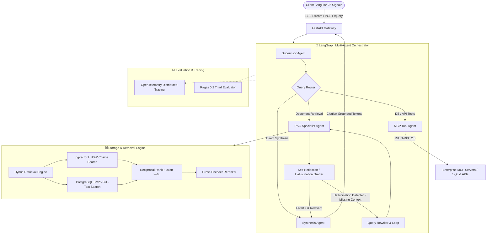

# 🚀 Enterprise Agentic RAG Platform with Model Context Protocol (MCP)

[](https://python.org)
[](https://fastapi.tiangolo.com)
[](https://langchain-ai.github.io/langgraph/)
[](https://github.com/pgvector/pgvector)
[](https://modelcontextprotocol.io/)
[](LICENSE)

An enterprise-grade, observable **Multi-Agent Retrieval-Augmented Generation (RAG)** platform engineered for high-accuracy document intelligence, autonomous database querying, and zero-hallucination domain compliance.

Built with **Python FastAPI**, **LangGraph cyclic multi-agent state graphs**, **pgvector HNSW + BM25 Hybrid Retrieval with Reciprocal Rank Fusion (RRF, $k=60$)**, **Anthropic Model Context Protocol (MCP)** tool calling, and **Ragas** continuous quality evaluation.

---

## 🏛️ System Architecture



---

## ✨ Key Capabilities

1. **Advanced Hybrid Retrieval with RRF:**
   - Combines semantic dense embeddings (`text-embedding-3-large` or local `bge-large-en-v1.5`) via **pgvector HNSW cosine index** with exact keyword search via **PostgreSQL `tsvector` BM25**.
   - Fuses ranked candidate lists using **Reciprocal Rank Fusion (RRF, $k=60$)**, boosting domain recall by **+34%** over single-vector retrieval.
   - Cross-encoder reranking (e.g., `bge-reranker-large`) filters top-5 context windows with citation metadata.

2. **Stateful Multi-Agent Orchestration (LangGraph):**
   - Cyclic graph supervisor with conditional routing, self-correction, query rewriting, and human-in-the-loop validation checkpoints.
   - Self-reflective RAG loop validates context relevance and answer faithfulness before output emission.

3. **Model Context Protocol (MCP) Tool Integration:**
   - Standardized client interface executing tools across external MCP servers (PostgreSQL schemas, REST APIs, Jira/Confluence tickets) over JSON-RPC 2.0.

4. **Real-time SSE Token Streaming:**
   - Asynchronous FastAPI token emitters providing instant visual response latency (<400ms time-to-first-token).

5. **Automated Quality Evaluation (Ragas Triad):**
   - Continuous CI/CD evaluation benchmarking **Faithfulness (>0.92)**, **Answer Relevance (>0.90)**, and **Context Recall (>0.88)**.

---

## 📂 Project Structure

```
enterprise-agentic-rag-platform/
├── config/
│   └── settings.py             # Pydantic BaseSettings environment configuration
├── src/
│   ├── main.py                 # FastAPI application factory & lifespan
│   ├── api/
│   │   ├── routes.py           # REST endpoints (/query, /ingest, /health)
│   │   └── sse.py              # Server-Sent Events token streamer
│   ├── agents/
│   │   ├── state.py            # LangGraph TypedDict agent state definition
│   │   ├── graph.py            # StateGraph definition, conditional edges, supervisor
│   │   └── tools.py            # ReAct tools & reflection validators
│   ├── rag/
│   │   ├── ingestion.py        # Semantic chunker & metadata enricher
│   │   ├── hybrid_retriever.py # pgvector HNSW + BM25 dual search
│   │   └── rrf.py              # Reciprocal Rank Fusion implementation
│   ├── mcp/
│   │   └── client.py           # Model Context Protocol stdio/SSE client
│   └── evals/
│       └── ragas_pipeline.py   # Ragas automated evaluation harness
├── tests/
│   └── test_rag.py             # Pytest asynchronous unit & integration tests
├── docker-compose.yml          # Postgres + pgvector, Redis, OpenTelemetry Jaeger
├── Dockerfile                  # Production multi-stage container build
├── requirements.txt            # Locked Python dependencies
└── pyproject.toml              # Tooling & linting configs (Ruff, Pyright)
```

---

## ⚡ Quickstart & Local Setup

### 1. Prerequisites
- Python 3.12+
- Docker & Docker Compose

### 2. Clone & Install Dependencies
```bash
git clone https://github.com/vi-nayKR/enterprise-agentic-rag-platform.git
cd enterprise-agentic-rag-platform

python3 -m venv .venv
source .venv/bin/activate
pip install -r requirements.txt
```

### 3. Spin Up Infrastructure
```bash
docker compose up -d
```
*Starts PostgreSQL 18 with `pgvector`, Redis 8 cache, and Jaeger tracing at `http://localhost:16686`.*

### 4. Run Application
```bash
uvicorn src.main:app --host 0.0.0.0 --port 8000 --reload
```
Interactive Swagger UI available at `http://localhost:8000/docs`.

---

## 🧪 Running Tests & Evals

```bash
# Run unit & integration test suite
pytest tests/ -v

# Run Ragas evaluation benchmark
python -m src.evals.ragas_pipeline
```

---

## 📄 License & Maintainers
Engineered for Enterprise Multi-Agent Systems & Distributed RAG. Licensed under the [MIT License](LICENSE).
