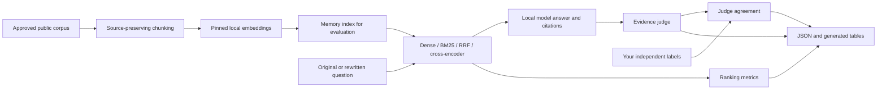

# EvidenceRAG

Evaluation upgrade in progress. The GitHub repository URL is unchanged.
The approved [SQuAD corpus and human review instructions](data/squad_v1/README.md)
and [generated dataset inventory](results/dataset_v1.md) are available. Benchmark
scores and judge agreement have not been measured yet. The implementation below
describes the existing reference, not the planned production features.

## Evaluation workflow

The approved dataset is SQuAD 1.1, distributed under CC BY-SA 4.0 by Stanford.
Questions and answer spans are original human annotations. This is a small
single-hop Wikipedia benchmark, not an enterprise-document or multi-hop benchmark.
The [dataset notice](data/squad_v1/README.md) documents selection, attribution,
source checksums, limitations, and your test-review procedure.

```bash
python -m venv .venv
# Activate the environment using your operating system's command.
python -m pip install torch --index-url https://download.pytorch.org/whl/cpu
python -m pip install -r requirements-eval.txt
python scripts/prepare_squad.py
python scripts/setup_local_judge.py
```

On Windows, run the downloaded local server in a separate terminal:

```powershell
.cache/judge/llama/llama-server.exe -m .cache/judge/qwen2.5-3b-instruct-q4_k_m.gguf --host 127.0.0.1 --port 8091 --alias evidencerag-local --ctx-size 4096 --parallel 1 --threads 2 --threads-batch 2 --no-webui
```

On Linux/macOS, install llama.cpp's `llama-server` using its platform instructions;
the model download script verifies the same pinned model artifact. Run it with
the same options. The local judge is Qwen2.5-3B-Instruct Q4_K_M. The Windows
inference binary and model checksums are pinned in the setup script. Model terms
are those published by Qwen; dataset licensing does not license model weights.

Copy `.env.example` to `.env` to configure the evaluator. Answering, rewriting,
and judging share one client and one total-run spending cap below $3. The local
default has no provider token charges. Remote endpoints require explicit token
prices and credentials; no secrets are committed. Every request records actual
token usage or a failed/unknown-usage status. Failed calls reserve their worst
case cost rather than becoming free paid retries. Electricity and hardware costs
are outside the provider-cost measurement.

```bash
make labels       # Actual dev answers; creates blank labels_todo.jsonl.
make eval-dev     # Development ablations while manual review is pending.
make eval         # Full run; refuses unreviewed test cases.
```

If `make` is unavailable on Windows, use respectively:

```bash
python -m src.evals.benchmark --split dev --prepare-labels
python -m src.evals.benchmark --split dev
python -m src.evals.benchmark --split all
```

You review `data/squad_v1/test_review.jsonl` yourself and supply the judge labels
in `data/squad_v1/labels_todo.jsonl` using the [labelling guide](data/squad_v1/LABELLING_GUIDE.md).
The agent never fills those labels. Missing calibration remains pending and
does not become an agreement score. Calibration scores use frozen model answers
and evidence, not regenerated answers. Benchmark JSON and Markdown tables are
written under `results/`; each records model versions and token costs.

The ablations vary one factor at a time: fixed/recursive/embedding-boundary
chunking, dense/BM25/hybrid/reranked hybrid retrieval, and query rewriting on/off.
This does not test every interaction or establish a global optimum. Rewriting
fuses original and rewritten query rankings. Chunk size and target overlap are
held constant, and embeddings and the cross-encoder use pinned model revisions.

Retrieval labels map gold answer spans to exact source-preserving chunks. Recall
measures the fraction of labelled chunks retrieved; MRR measures how early the
first relevant chunk appears in the returned ranking; nDCG rewards relevant
chunks near the top. MRR is truncated at the recorded retrieval depth. Missing
gold support after chunking counts as zero and is reported separately. Original
SQuAD labels are not exhaustive relevance annotations across the whole corpus.

Faithfulness is the judge's fraction of supported claims; relevance asks whether
the answer answers the question; citation accuracy checks each exact cited chunk
against its claim. Judge predictions require your calibration before acceptance.
Abstention has no defined claim-faithfulness score. Tables retain missing values,
valid-judgement counts, and failures so selective scoring cannot look complete.
Latency measures warm-index requests, with result/embedding caches disabled;
answer latency includes rewriting and retrieval, and excludes evaluation judging.

**Checkpoint:** stop after the ablations and their explanation. PostgreSQL,
corrective RAG, streaming, tracing, and fine-tuning need your next approval.
Resume bullets will be based on accepted results after your review.


```mermaid
flowchart LR
    S[Approved public corpus] --> C[Source-preserving chunking]
    C --> E[Pinned local embeddings]
    E --> I[Memory index for evaluation]
    Q[Original or rewritten question] --> R[Dense / BM25 / RRF / cross-encoder]
    I --> R
    R --> A[Local model answer and citations]
    A --> J[Evidence judge]
    H[Your independent labels] --> V[Judge agreement]
    J --> V
    R --> M[Ranking metrics]
    J --> O[JSON and generated tables]
    M --> O
    V --> O
```

A FastAPI and LangGraph prototype for exploring document retrieval, query routing, citations, and tool calls. This is a **learning reference**, not a deployed enterprise service or a measured high-accuracy RAG system.

## What the code implements

- Document ingestion, chunking, and an **in-memory** document store (`src/rag/document_store.py`). Documents and chunks disappear when the process restarts.
- Dense similarity over generated vectors, a Python BM25-like lexical scorer, reciprocal rank fusion, reranking, and context compression. An OpenAI embedding provider can be configured; without it, the code uses deterministic token-hash vectors.
- A LangGraph route through retrieval, heuristic reflection, bounded query rewriting, and synthesis (`src/agents/graph.py`).
- FastAPI routes for uploading text, querying, streaming events, listing documents, and discovering built-in tools (`src/api/routes.py`).
- In-process tool examples for a database-shaped data source and an API-shaped data source. `src/mcp/client.py` calls local Python server objects using JSON-RPC-like request models; this repository has not demonstrated an independently interoperable MCP client/server connection.
- A small evaluation dataset and token-overlap heuristics (`src/evals/metrics.py`). These metrics are **not Ragas metrics** and do not establish factual correctness or hallucination rates.

The `docker-compose.yml` file starts supporting services for experimentation. The inspected retrieval path uses the in-memory store; it does not use pgvector HNSW or PostgreSQL full-text search. Descriptions in older `docs/phase*.md` files are historical design notes and may discuss proposed capabilities beyond the current code.

## Run locally

Python 3.12 is recommended.

```bash
git clone https://github.com/vi-nayKR/enterprise-agentic-rag-platform.git
cd enterprise-agentic-rag-platform
python3.12 -m venv .venv
source .venv/bin/activate
python -m pip install -r requirements.txt
uvicorn src.main:app --host 127.0.0.1 --port 8000
```

Open `http://127.0.0.1:8000/docs`. Upload a small text document with `POST /documents/upload`, then ask a question with `POST /query`. The API does not have authentication or upload limits; run it locally with non-sensitive sample data.

```bash
python -m pytest tests -q
python -m src.evals.ragas_pipeline
```

The evaluation command's historical name contains `ragas`, but its implementation uses local token-overlap scoring. No versioned, held-out, live-provider result is published here. Numeric recall, latency, and cost improvement claims require a fixed dataset, baseline, environment, and recorded run before they can be made.

## What to improve next

1. Choose one real retrieval task and create a held-out dataset with answer and citation labels.
2. Compare lexical, dense, and fused retrieval on the same cases, reporting failures and latency.
3. If persistence is needed, implement and exercise PostgreSQL/pgvector rather than treating the current in-memory search as equivalent.
4. If cross-client tool interoperability is needed, use a protocol SDK and test a separate MCP client and server with appropriate authorization.
5. Add authentication, tenant boundaries, upload validation, and rate limits before exposing the API to untrusted users.

This repository has no checked-in license file. Contact the author before reusing its code outside the terms GitHub provides for viewing and forking.
