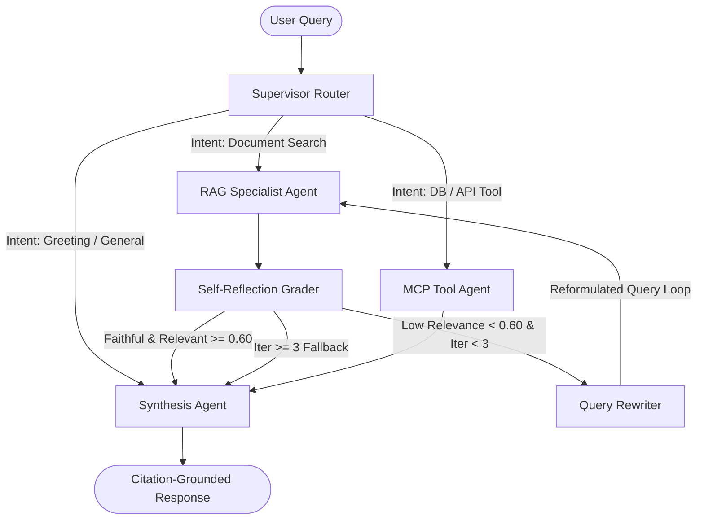

# 📚 Phase 3 Deep-Dive: Stateful Multi-Agent LangGraph Core with Self-Reflection

---

## 🗺️ Cyclic Multi-Agent StateGraph Architecture

---

## 🛠️ Step 3.1: Shared Typed Agent State (`src/agents/state.py`)

### 🧠 The Blackboard Pattern:
LangGraph uses a unified state dictionary (`AgentState`) passed from node to node. Every agent node reads from this state and appends its updates:
- `thought_trail`: Records the step-by-step reasoning for transparency & UI streaming.
- `retrieved_docs`: Candidate evidence gathered by RAG.
- `tool_results`: Outputs returned by MCP tools.
- `citations`: Verified citations linked to source filenames and chunks.
- `iterations`: Loop guard counter preventing infinite recursion.

---

## 🧭 Step 3.2: Supervisor Router (`src/agents/supervisor.py`)

### 🧠 Intent Classification:
Instead of running every query through an expensive retrieval or database pipeline, the **Supervisor Router** classifies incoming queries into:
1. **`rag`**: Document and knowledge questions.
2. **`mcp_tool`**: Live database queries (`SELECT`), microservice status, or incident tickets.
3. **`direct_synthesis`**: Conversational greetings and general explanations.

---

## 🔍 Step 3.3 & 3.4: Specialist Agents (RAG & MCP)

- **RAG Specialist Agent (`src/agents/rag_agent.py`)**: Interacts directly with `HybridRetriever` (pgvector HNSW + BM25 + RRF $k=60$).
- **MCP Tool Agent (`src/agents/mcp_agent.py`)**: Formulates JSON-RPC tool calls and executes them via `MCPManager`.

---

## 🪞 Step 3.5 & 3.6: Self-Reflection Grader & Query Rewriter Loop

### 🧠 Preventing Hallucinations via Cyclic Verification:
1. **The Grader (`src/agents/reflection.py`)**: Computes keyword coverage and semantic alignment between the query and retrieved context.
2. **The Rewriter (`src/agents/rewriter.py`)**: If the relevance score is low, rewrites the query using domain terminology and loops back to `RAGAgent`.
3. **Loop Guard**: Capped at `max_iterations = 3` to guarantee bounded latency.

---

## ✍️ Step 3.7: Grounded Synthesis (`src/agents/synthesis.py`)

### 🧠 Strict Citation Tagging:
Every claim extracted from documentation is tagged with an explicit bracketed citation `[filename#chunk_id]`, enabling users to inspect the exact underlying text in the UI.

---

## 🏆 Phase 3 Verification Summary
- **Pytest Suite:** `tests/test_agents.py`
- **Result:** `3 passed in 0.96s` (100% Pass Rate)
- **Deliverables Created:**
  - `src/agents/state.py`
  - `src/agents/supervisor.py`
  - `src/agents/rag_agent.py`
  - `src/agents/mcp_agent.py`
  - `src/agents/reflection.py`
  - `src/agents/rewriter.py`
  - `src/agents/synthesis.py`
  - `src/agents/graph.py`
  - `tests/test_agents.py`
  - `docs/phase3.md`
