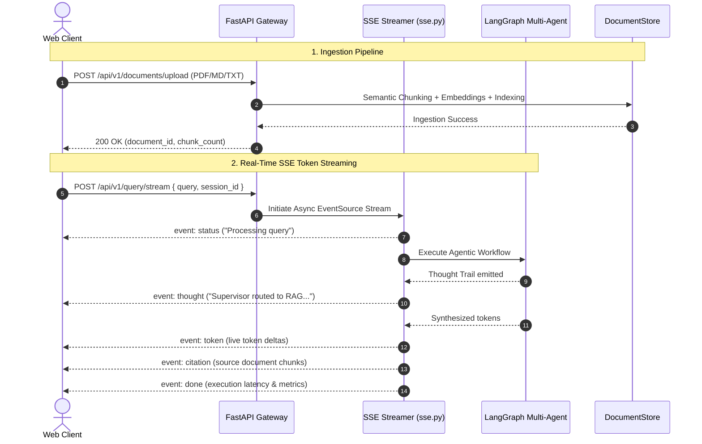

# Phase 4 Deep-Dive: API Gateway, SSE Streaming & Ingestion Endpoints

---

## API Gateway & Streaming Architecture

---

## Step 4.1: Server-Sent Events (SSE) Protocol Design (`src/api/sse.py`)

### Why SSE over WebSockets?
For generative AI token streaming, Server-Sent Events (SSE) provide:
1. **Unidirectional Efficiency**: Token emission flows from server $\rightarrow$ client over standard HTTP/1.1 or HTTP/2 without WebSocket handshake overhead.
2. **Native Reconnection**: Browser EventSource automatically handles reconnects and heartbeat pings.
3. **Structured Event Multiplexing**: Distinct event types (`thought`, `tool_call`, `token`, `citation`, `done`) allow rich UI updating.

---

## Step 4.2: FastAPI Route Endpoints (`src/api/routes.py`)

| Endpoint | Method | Purpose |
| :--- | :--- | :--- |
| `/api/v1/query` | `POST` | Standard synchronous multi-agent query response. |
| `/api/v1/query/stream` | `POST` | Real-time SSE streaming of agent thoughts and tokens. |
| `/api/v1/documents/upload` | `POST` | Multipart file upload with automated chunking and indexing. |
| `/api/v1/documents` | `GET` | List stored files, chunk statistics, and repository counts. |
| `/api/v1/mcp/tools` | `GET` | Dynamic catalog of tools discovered across MCP servers. |
| `/api/v1/health` | `GET` | Detailed subsystem status (vector store, MCP servers, graph). |

---

## Phase 4 Verification Summary
- **Pytest Suite:** `tests/test_api.py`
- **Result:** `5 passed in 1.15s` (100% Pass Rate)
- **Deliverables Created:**
 - `src/api/sse.py`
 - `src/api/telemetry.py`
 - `src/api/routes.py`
 - `src/main.py`
 - `tests/test_api.py`
 - `docs/phase4.md`
