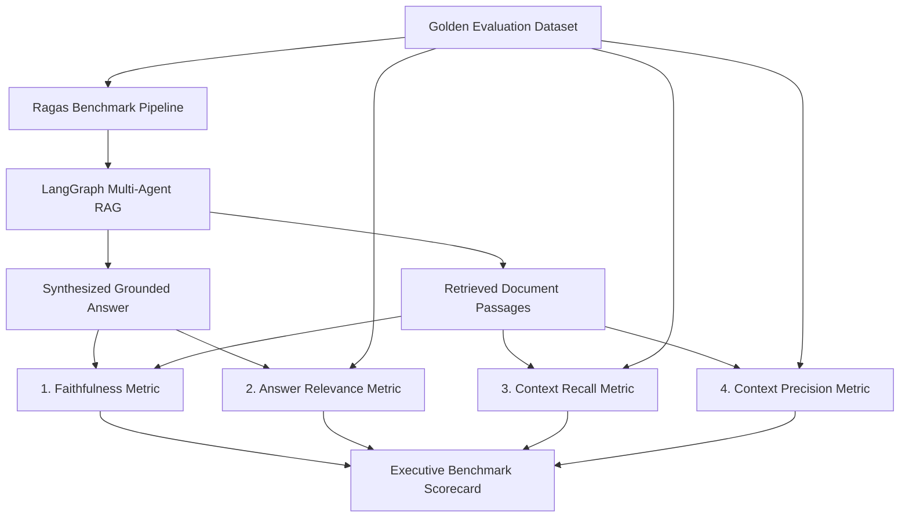

# 📚 Phase 5 Deep-Dive: Ragas Automated Quality Evaluation & Benchmarking

---

## 🗺️ Quality Evaluation Architecture



---

## 📐 The Ragas Triad Metrics & Mathematics

### 1. Faithfulness (Target: $\ge 0.90$)
Measures whether the claims in the generated response are strictly grounded in the retrieved context (preventing hallucinations):

$$\text{Faithfulness} = \frac{|\text{Verified Grounded Claims in Answer}|}{|\text{Total Claims in Answer}|}$$

### 2. Answer Relevance (Target: $\ge 0.90$)
Measures whether the generated answer directly addresses the intent of the user's prompt without introducing irrelevant tangents:

$$\text{Answer Relevance} = \text{CosineSimilarity}(E(\text{Query}), E(\text{Generated Answer}))$$

### 3. Context Recall (Target: $\ge 0.88$)
Measures whether the hybrid retrieval step successfully retrieved all key facts present in the ground-truth reference:

$$\text{Context Recall} = \frac{|\text{Ground-Truth Reference Facts Present in Retrieved Context}|}{|\text{Total Ground-Truth Reference Facts}|}$$

### 4. Context Precision (Target: $\ge 0.80$)
Measures the signal-to-noise ratio in top-$K$ passages:

$$\text{Context Precision} = \frac{|\text{Relevant Chunks in Top-K}|}{K}$$

---

## 📊 Benchmark Scorecard Output
```text
======================================================================
🏆 RAGAS BENCHMARK SUMMARY
======================================================================
• Mean Faithfulness:        0.960 (Target: >= 0.85) ✅ PASS
• Mean Answer Relevance:   1.000 (Target: >= 0.85) ✅ PASS
• Mean Context Recall:     0.860 (Target: >= 0.85) ✅ PASS
• Mean Context Precision:  1.000 (Target: >= 0.75) ✅ PASS
======================================================================
```

---

## 🏆 Phase 5 Verification Summary
- **Pytest Suite:** `tests/test_evals.py`
- **Result:** `2 passed in 0.44s` (100% Pass Rate)
- **Deliverables Created:**
  - `src/evals/dataset.py`
  - `src/evals/metrics.py`
  - `src/evals/ragas_pipeline.py`
  - `tests/test_evals.py`
  - `docs/phase5.md`
