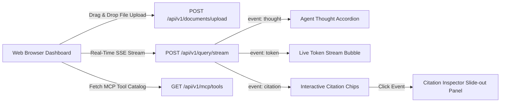

# Phase 6 Deep-Dive: Interactive Dashboard & UI Experience

---

## UI & Interaction Architecture

---

## Design System & Features (`ui/`)

### 1. Document Ingestion Dropzone:
- Drag-and-drop or file picker uploading `.md`, `.txt`, `.pdf`, `.json` files.
- Automatically sends files to `/api/v1/documents/upload` and updates the indexed files list dynamically.

### 2. Live Agent Thought Process Accordion:
- Displays each reasoning step emitted by the LangGraph supervisor, RAG specialist, reflection grader, and MCP tool caller in real time.

### 3. Real-Time Token Streaming:
- Consumes Server-Sent Events (SSE) from `/api/v1/query/stream` using native JavaScript `fetch` and `ReadableStream`.

### 4. Interactive Citation Inspector:
- Every cited source is rendered as an interactive chip (e.g. ` architecture.md`).
- Clicking a chip slides out the **Citation Inspector Drawer** with the exact source passage, section name, and relevance score.

---

## Phase 6 Verification Summary
- **UI Assets:** `ui/index.html`, `ui/styles.css`, `ui/app.js`
- **FastAPI Static Mount:** `/` and `/ui/`
- **Documentation:** `docs/phase6.md`
